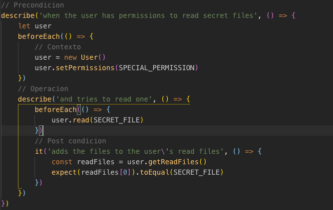
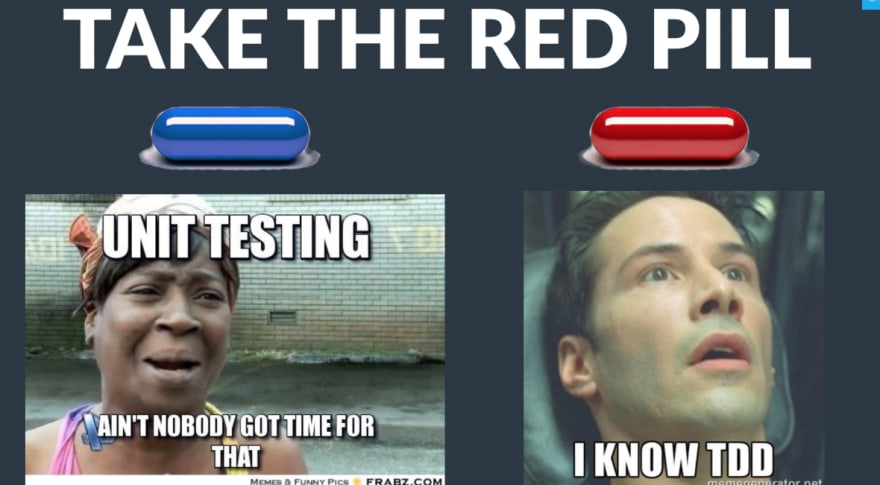

import {
  Invert,
  Split,
  SplitRight,
  Horizontal,
  FullScreenCode,
} from '@mdx-deck/layouts'
export { default as theme } from './theme'

import { Appear } from 'mdx-deck'

import { Notes } from 'mdx-deck'


<Invert>

# Hola !

</Invert>

---

<Invert>
<Split>


## Quien soy ?

<Appear>

#### Gonzalo gras cantou (Guusy)
#### 22 años 
#### Mercadolibre  
#### :dog: :dog: :dog: :dog:

<Notes>
- Mi me llamo ....
<br/>
- Tengo 22 años
<br/>
- Trabajo actualmente en...
<br/>
- Tengo 4 perros y los amo mucho
</Notes>
</Appear>

</Split>
</Invert>

---

# Partes del test



<Notes>

- Precondicion : Escenario.
- Operacion : la funcionalidad ejecutandose.
- Postcondicion : Lo que se espera que devuelva o que afecte a otros componentes.

</Notes>

---

# ¿Qué es TDD?

<Notes>
Preguntar : Cuantos trabajan programando o estan arrancando.
Preguntar : si alguien conoce tdd o lo uso ?

<br/>
Que tanto me creerian si les digo que existe una manera de no tener mas bugs para siempre y gratis?
</Notes>

---
<Invert>


</Invert>

---
<h4 style={{textAlign:"start"}}> TDD es </h4>


<Notes>
Es un herramienta, una manera de desarollar, que esta orientada a los test.
Preguntar: por que es importante el test fallar ?

- Ver el test fallar (falsos positivos, test que pasan de una)
- Explicar por que los commits ! (mas facil debug) (pasito a pasito)
- El minimo codigo para hacer que el test pase, codigo simple

</Notes>

---
## ¿ Por que TDD ? :smile:
---
<Invert>

## Calidad de diseño
<Notes>
El diseño queda mas simple ya que como nosotros somos los primeros usuarios de nuestro codigo, esto genera una interfaz amigable.
Ademas vemos como queremos que contesten nuestros componentes y mientras codeamos el test nos damos cuenta que tan facil es usarlo
</Notes>
</Invert>

---

## Mejora la calidad de tests
<Notes>

- Tests cohesivos (que es ?),con una sola responsabilidad, que nos permite entender mejor cuando algo falla, por que fallo. 

- Evitamos tests redundantes (mejores contextos)

- Código sin testear  

</Notes>

---

<Invert>

## Feedback inmediato 
<Notes>

Al estar pensando en los diferentes casos: 

- Nos damos cuenta de los casos que no estan la definicion funcional
- Super valioso por que podemos levantar la mano en el medio del desarollo y decir "Aca nos esta faltando algo" y que esto dispare una charla con ux o con producto para  poder ver ese caso, es una forma de retroalimentarse

</Notes>

</Invert>

---
## Documentación automatica 
<Notes>
- Preguntar: quien le gusta escribir documentación ? Que pasa con la doc ?
- Bueno para usuarios de nuestro proyecto, programadores nuevos, y para el code review
- Es la documentación del codigo mas actualizada.
- Lo importante es escribir test con buena calidad.
</Notes>

---

<Invert>

## Codigo 100% testeado

<Notes>

- Ya que que esta metolodogia se basa en escribir los tests antes de implementar, vamos a tener si o si el 100% de nuestro codigo testeado
- Que pasa si tienen un muerto,sin test ? 

</Notes>
</Invert>

---

## No mas miedo

<Notes>
- A los refactors.
- A agregar nuevas features.
- Al tener todos nuestros caso de usos testeados, nos da la completa libertad de poder refactorizar el codigo a gusto

</Notes>

---

## Buenas practicas :100:

---

<Invert>

## 5 minutes commit
<Notes>

</Notes>

</Invert>

---

## Representar bien los contextos

---
<Invert>

## Evitar la ansiedad, No adelantar refactors
<Notes>

</Notes>

</Invert>

---

## Testear errores y la invariancia
<Notes>
Excepcion y que pasa en nuestro dominio luego de eso ?  el estado
</Notes>


---
<Invert>

## Hacer tdd al corregir bugs

</Invert>

---

## COBERTURA
<Notes>
- Preguntar que es la corbertura para la people ?  o que concepto tienen de ella ?
- Es lo mismo que todo el codigo testeado ?  se puede confiar ?

</Notes>

---

<Invert>

<Split>

```js
const readABook = (user, book) => {
    book.actualLector = user
    user.readBooks.push(book)
}
```

```
describe('when a user reads a books', () => {

    beforeEach(() => {
        readABook(user, book)
    })
    
    it('marks the user as actualLector in book', () => {
        expect(book.actualLector).toEqual(user)
    })
})
```

</Split>  

</Invert>

---

#### 100% DE COBERTURA !== ESTA TODO TESTEADO
<Notes>
- Poner codigo, q recorra todo el codigo.
</Notes>

---



---

# ¿ Preguntas ?

---
# Workshop 


---
# ¿Que vamos a hacer?
# :tada:

---

# Wallet 

---

<Invert>

<Notes>
La idea de es hacer un calendario con ciertas features
<br/>
Aclarar que lo mas seguro es que no se llegue a todo lo especificado, pero esta el github para seguir trabajando en casa
</Notes>
</Invert>

---

<Invert>
<h2>https://github.com/Guusy/tdd_workshop</h2>
</Invert>