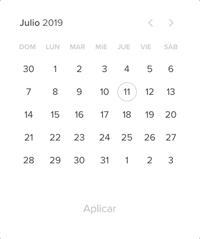

import {
  Invert,
  Split,
  SplitRight,
  Horizontal,
  FullScreenCode,
} from '@mdx-deck/layouts'
export { default as theme } from './theme'

import { Appear } from 'mdx-deck'

import { Notes } from 'mdx-deck'

<Invert>

# Hola !

</Invert>

---

<Invert>
<Split>

## Quien soy ?

<Appear>

#### Gonzalo gras cantou (Guusy)
#### 22 años 
#### Mercadolibre  
#### :dog: :dog: :dog: :dog:

<Notes>
- Mi me llamo ....
 
- Tengo 22 años
 
- Trabajo actualmente en...
 
- Tengo 4 perros y los amo mucho
</Notes>

</Appear>

</Split>
</Invert>

---

# ¿Qué es TDD?

<Notes>
Preguntar : Cuantos trabajan programando o estan arrancando.
 
Que tanto me creerian si les digo que existe una manera de no tener mas bugs para siempre y gratis?
</Notes>

---
<Invert>

</Invert>

---
<h4 style={{textAlign:"start"}}> TDD es </h4>

<Notes>
Es un herramienta, una manera de desarollar, que esta orientada a los test.
 
1) Test que falle  
2) codigo mas simple para que el test pase (unico objetivo)  
3) (posible refactor)  
4) ver el test pasar ( optional : commit )  
</Notes>

---
## ¿ Por que TDD ?
---

### Codigo 100% testeado
<Appear>

### No bugs 
### Codigo abierto a refactors totalmente 
### Mejores tests 
### Feedback inmediato 
### Documentación automatica 

<Notes>
Desarrollo orientado al diseño (Simplicidad. Evitar sobre diseños. Interfaces amigables)
Queda mas simple el diseño y por que empezamos a diseñar pensando en la interfaz y
como queremos que contesten nuestros componente, por que el primer usuario del componente vamos a hacer nosotros,
mientras codeamos el test nos damos cuenta que tan facil es usarlo

Mejores tests (Tests cohesivos. Más rápidos. Evitamos tests redundantes y código sin testear) 
Tiene una sola responsabilidad, nos permite entender mejor cuando algo falla, por que fallo. Evitamos test redundantes y
 codigo sin testear. si hacemos un test y da verde entonces nos adelantamos, o estamos probando algo que ya esta resuelto

Feedback inmediato (De requerimientos, implementación y diseño) Al estar pensando en las diferentes clases de equivalencias, 
nos damos cuenta de los casos que no estan la definicion funcional y eso es super valioso por que podemos levantar la mano en el medio del desarollo y
decir "Aca nos esta faltando algo" y que esto dispare una charla con ux o con producto para  poder ver ese caso, es una forma de retroalimentarse

Documentación actualizada (bueno para usuarios de nuestro proyecto, programadores nuevos, y para el code review)
Es la mejor Documentación del codigo ya que basicamente es lo que corre y da verde <3, si le metemos cabeza para que sean faciles de leer, uno puede entrar y ver 
</Notes>

</Appear>

---
## Buenas practicas

<Appear>

- Evitar la ansiedad. No adelantar refactors
- 5 minutes commit
- Representar bien los contextos
- Testear errores
- Hacer tdd al corregir bugs

</Appear>

---

#### 100% DE COBERTURA !== ESTA TODO TESTEADO

---
# Workshop 

---
# ¿Que vamos a hacer?
# :tada:

---
<Invert>

<Notes>
La idea de es hacer un calendario con ciertas features
 
Aclarar que lo mas seguro es que no se llegue a todo lo especificado, pero esta el github para seguir trabajando en casa
</Notes>
</Invert>

---

<Invert>
<h2>https://github.com/Guusy/tdd_workshop</h2>
</Invert>