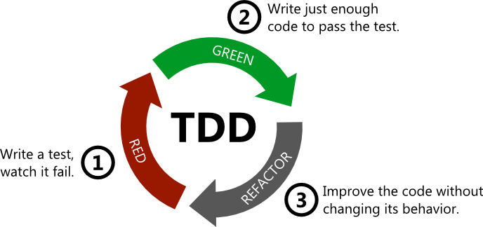

import {
  Invert,
  Split,
  SplitRight,
  Horizontal,
  FullScreenCode,
} from '@mdx-deck/layouts'

import { Appear } from 'mdx-deck'

import { Notes } from 'mdx-deck'

<Invert>

# Hola !

</Invert>

---

<Invert>
<Split>

## Quien soy ?

<Appear>

#### Gonzalo gras cantou 
#### 22 años 
#### Mercadolibre  
#### :dog: :dog: :dog: :dog:

<Notes>
- Mi me llamo ....
 
- Tengo 22 años
 
- Trabajo actualmente en...
 
- Tengo 4 perros y los amo mucho
</Notes>

</Appear>

</Split>
</Invert>

---

# ¿Qué es TDD?

<Notes>
Preguntar : Cuantos trabajan programando o estan arrancando.
 
Que tanto me creerian si les digo que existe una manera de no tener mas bugs para siempre y gratis?
</Notes>

---
<Invert>

</Invert>

---
<h4 style={{textAlign:"start"}}> TDD es </h4>

<Notes>
Es un herramienta, una manera de desarollar, que esta orientada a los test.
 
1) Test que falle  
2) codigo mas simple para que el test pase (unico objetivo)  
3) (posible refactor)  
4) ver el test pasar ( optional : commit )  
</Notes>

---
## Ventajas
- Codigo 100% testeado
- No bugs :heart:
- Codigo abierto a refactors totalmente

---

## Buenas practicas

<Appear>

- Evitar la ansiedad. No adelantar refactors
- 5 minutes commit
- Representar bien los contextos
- Testear errores
- Hacer tdd al corregir bugs

</Appear>

